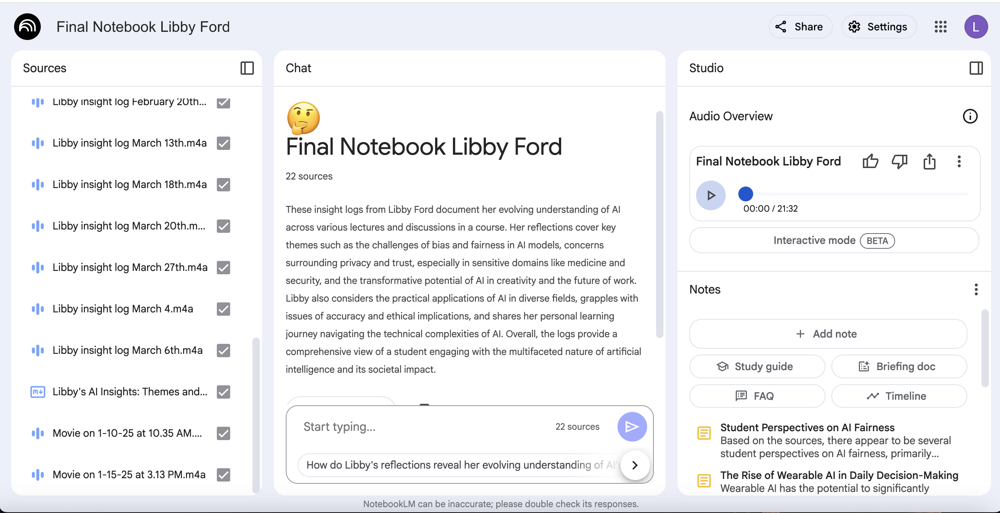

## Data Science Portfolio

This repository serves as a structured reflection on my journey through the Data Science Minor. It contains insights, projects, and ethical considerations related to my coursework.

## Reflections
Each markdown file in the `reflections/` directory provides insights into my experience with a specific course, including key learnings, challenges, and applications of data science principles.

### Reflection Files
- **[SOAN265 Reflection](reflections/SOAN265.md)** - Exploring Social Networks

  
  
- **[SOAN266 Reflection](reflections/SOAN266.md)** - Neighborhoods and Inequality

  

- **[SOAN218 Reflection](reflections/SOAN218.md)** - Basic Statistics in the Social Sciences

  
- **[CBSC185 Reflection](reflections/CBSC185.md)** - Introduction to Data Science: Trends Over Time

  
- **[BUS306F Reflection](reflections/BUS306F.md)** - Data Visualization
- **[DS195B Reflection](reflections/DS195B.md)** - Data for Deep Learning

## Projects
The `projects/` directory contains relevant files and scripts from coursework projects, showcasing my progression in coding, data visualization, and statistical modeling. PDFs of final projects are included in their respective folders.
- **[SOAN265 Final Project](projects/SOAN265.pdf)** - Exploring Social Networks

Example Visualization: 
   
   
- **[SOAN266 Final Project](projects/SOAN266.pdf)** - Neighborhoods and Inequality
  
Example Visualization: 
   
   
- **[SOAN218 Final Project](projects/SOAN218.pdf)** - Basic Statistics in the Social Sciences

Example Visualization: 
  
  
- **[CBSC185 Final Project](projects/CBSC185.docx)** - Introduction to Data Science: Trends Over Time

Example Visualization: 

- **[BUS306F Final Project](projects/BUS306F.pdf)** - Data Visualization

Example Visualization:
 
  
- **[DS195B Final Podcast](projects/DS195)** - Data for Deep Learning

Final Notebook LM:
 

## Ethics
The `ethics.md` file outlines the ethical considerations I have learned and applied throughout my coursework in data science.
**[Ethics.md](ethics/ethics.md)**

---

This repository demonstrates my development in data science and serves as a resource for future students interested in the minor.

